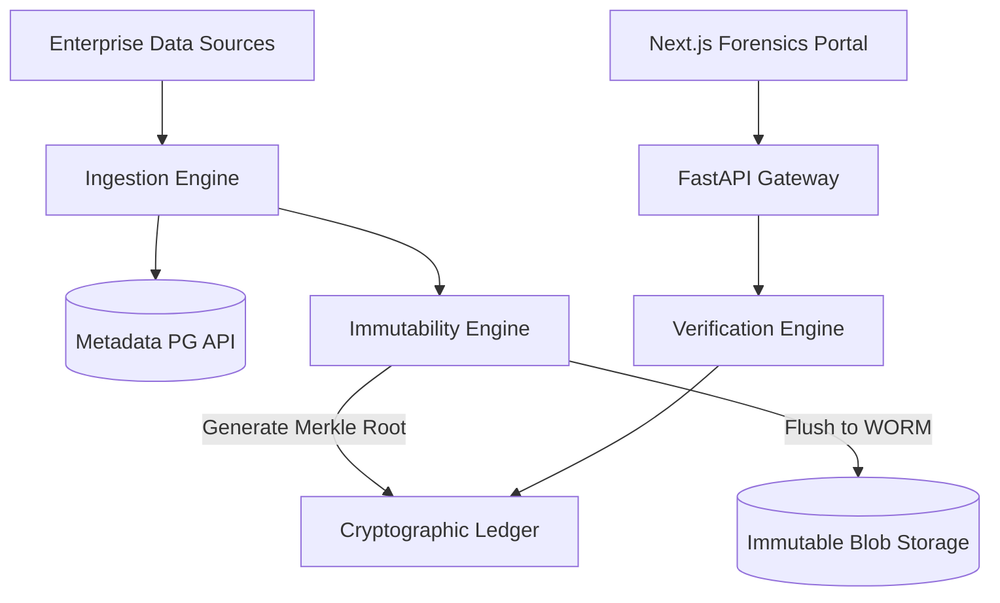
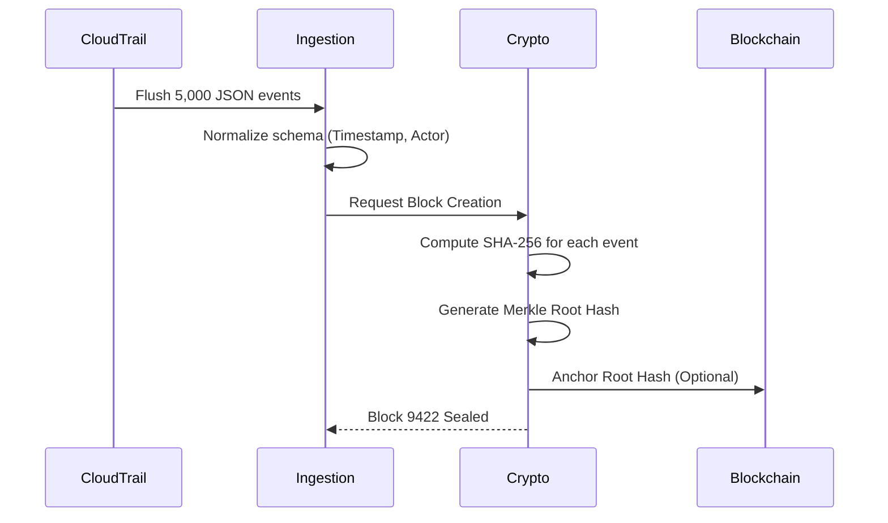
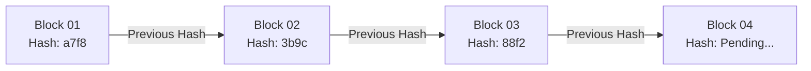
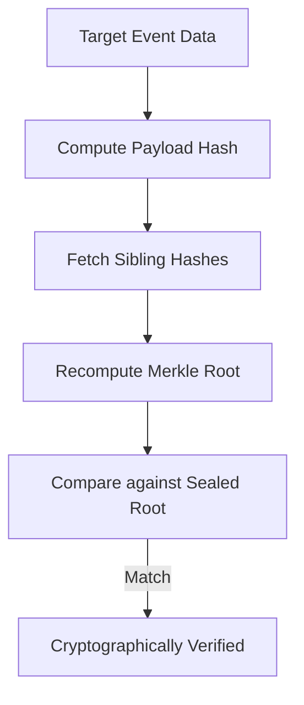
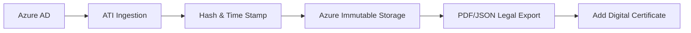
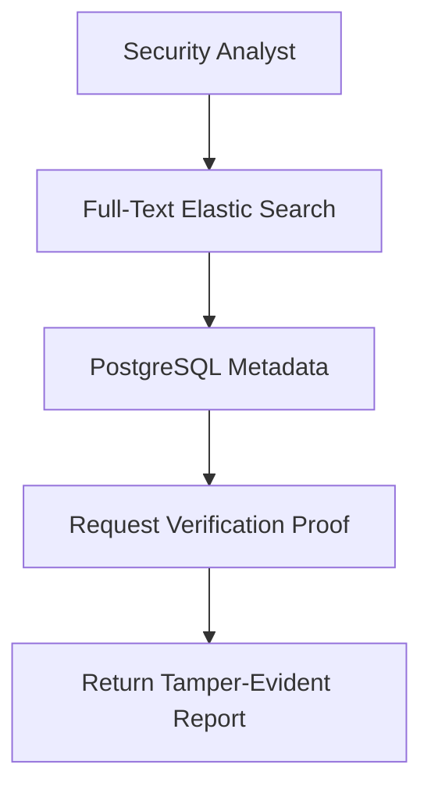
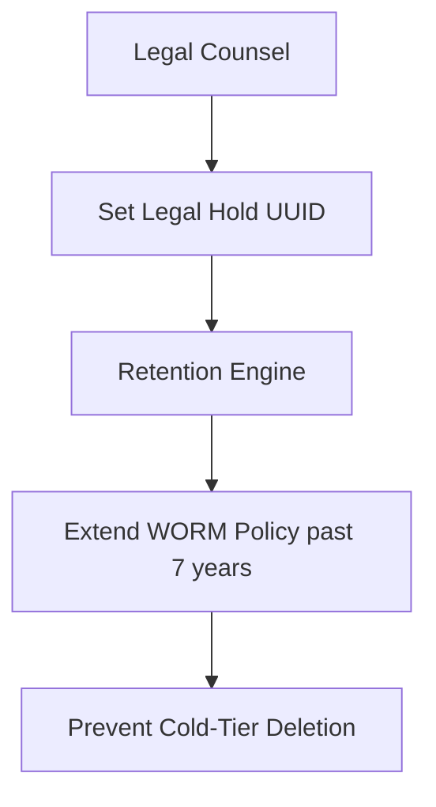
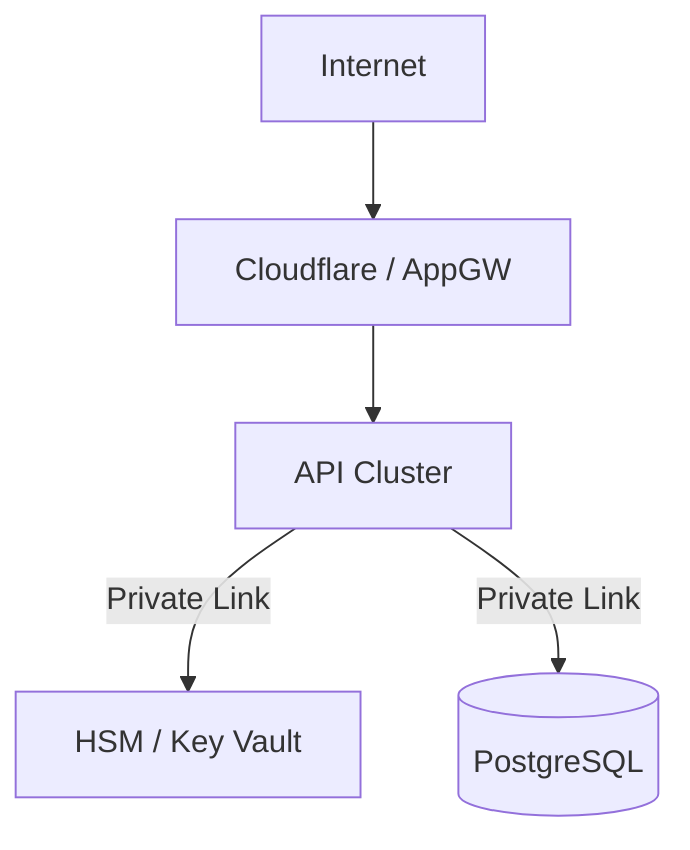
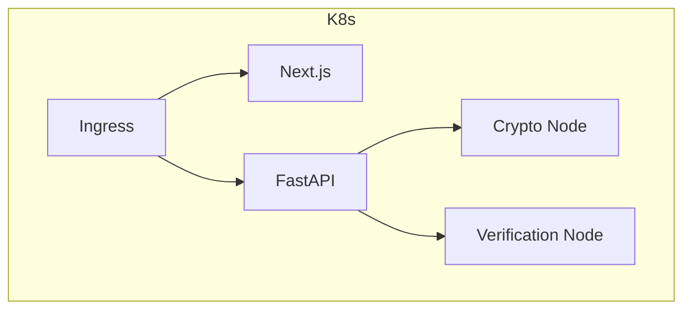

<div align="center">


<h1>Audit Trail Immutability Platform</h1>

<p><strong>Cryptographic Chain-of-Custody and Tamper-Proof Evidence Management</strong></p>

[](https://devopstrio.co.uk/)
[](/crypto)
[](/terraform)
[](https://devopstrio.co.uk/)

</div>

---

## 🏛️ Executive Summary

The **Audit Trail Immutability (ATI)** platform is the definitive legal truth engine for Devopstrio. It aggregates millions of discrete operational events—from Kubernetes RBAC changes to Azure AD object modifications—and cryptographically seals them using cryptographic Hash Chaining and Merkle Trees. 

Any attempt to manipulate or delete historical audit logs is instantly detected, triggering immediate SOC incident alerts. All underlying blobs are secured via Write-Once-Read-Many (WORM) hardware-level retention policies.

### Strategic Business Outcomes
- **Legal Non-Repudiation**: Evidence exported from ATI contains mathematical proofs verifying exactly when an event occurred and that it has not been altered since ingestion.
- **WORM Immutability**: Underlying storage accounts leverage time-based legal hold policies. Cloud administrators cannot modify or delete logs, even with `Owner` privileges.
- **Unified Forensic Timeline**: Correlates sparse SIEM data, GitHub repository actions, and API executions into a single chronological chain.
- **Cost-Optimized Archiving**: Automatically ages older cryptographic blocks into Azure Cold Storage / AWS Glacier while maintaining search index parity.

---

## 🏗️ Technical Architecture Details

### 1. High-Level Architecture


### 2. Log Ingestion Workflow


### 3. Hash Chain Lifecycle


### 4. Merkle Verification Flow


### 5. Chain-of-Custody Workflow


### 6. Forensics Investigation Flow


### 7. Legal Hold Lifecycle


### 8. Security Trust Boundary


### 9. AKS Topology


### 10. API Request Lifecycle
```mermaid
graph LR
    Client --> API Gateway
    API Gateway --> Auth[Token Validation OIDC]
    Auth --> Route[/logs/search]
    Route --> DB
```

---

## 🛠️ Global Platform Components

| Engine | Directory | Purpose |
|:---|:---|:---|
| **Forensics Portal** | `apps/portal/` | Executive Next.js interface for legal discovery. |
| **Ingestion Engine** | `apps/ingestion-engine/` | Massively concurrent parsers for syslog and Cloud APIs. |
| **Crypto Engine** | `crypto/` | Core mathematical library yielding Merkle Trees and Signatures. |
| **Verification Engine**| `apps/verification-engine/`| Nightly cron jobs validating the integrity of history. |

---

## 🚀 Environment Deployment

Provision the zero-trust data environment.

```bash
cd terraform/environments/prod
terraform init
terraform apply -auto-approve
```

---
<sub>&copy; 2026 Devopstrio &mdash; Absolute Mathematical Truth.</sub>
